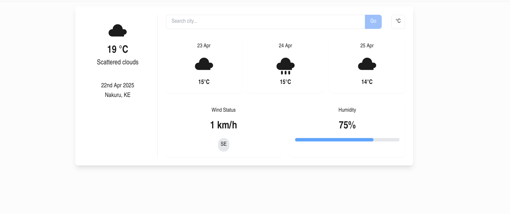

# WeatherApp 🌦️

A full-stack weather app built with:

- **Frontend**: [Next.js + TypeScript + RippleUI](./frontend/README.md)
- **Backend**: [Laravel (API only)](./backend/README.md)
- **Data Source**: OpenWeatherMap API

<br/>



---

## Getting Started

### Backend

See the [backend README](./backend/README.md) for full setup instructions.

```bash
cd backend
cp .env.example .env
# Add your OPENWEATHERMAP_API_KEY in .env
php artisan serve
```

### Frontend

See the [frontend README](./frontend/README.md) for full setup instructions.

```bash
cd frontend
npm install
npm run dev
```

---

## Project Structure

```
Weather-Application/
├── backend/    # Laravel API backend
│   └── README.md
├── frontend/   # Next.js frontend
│   └── README.md
└── README.md   # (this file)
```

---

## More Info

- [Frontend Documentation](./frontend/README.md)
- [Backend Documentation](./backend/README.md)

---

**WeatherApp** &copy; 2025
